# FinPay

- **Service:** finpay
- **Type:** Portfolio project — personal banking dashboard
- **Stack:** Next.js 16 (App Router) · React 19 · TypeScript · Supabase (Postgres + Auth + RLS) · Zustand · Tailwind CSS v4 · Vitest
- **Status:** Demo
- **Live demo:** https://finpay-urzhanrisbek99s-projects.vercel.app

**Description:**

FinPay is a personal banking dashboard — money transfers (by phone, card, and QR), card management, and spending analytics. It treats a toy domain with real fintech rigor: **money moves only on the server, atomically**, and card CVVs are **encrypted at rest**.

## Demo account

Open the [live demo](https://finpay-urzhanrisbek99s-projects.vercel.app) and sign in with:

```
Email:    demo@finpay.app
Password: FinPayDemo2026!
```

It holds a Visa card with a 600 000 ₸ monthly limit and a few months of activity — salary and freelance income, transfers by phone and by card, QR payments, and one failed charge. Registering your own account works too, but it opens empty: balance starts at zero and `add_income` is the only way money enters the system, which is the design rather than a missing seed.

Anything done in the demo adds to its history without rewriting it: the ledger is append-only to clients ([`0010_lock_transactions.sql`](supabase/migrations/0010_lock_transactions.sql)), so transactions can be created but never edited or deleted from the browser.

The history itself comes from [`supabase/seed/demo.sql`](supabase/seed/demo.sql), run once in the Supabase SQL editor. It exists because the app has no way to write it: `created_at` is whatever `now()` was when the RPC ran, and the client cannot insert into the ledger at all — which is exactly the property the seed has to step around, and the reason it runs as `postgres` rather than through the app. Dates are relative to the run, so the demo stays recent; re-running it replaces everything before today and leaves today's activity alone.

## Screenshots

### Dashboard

Balance, month-to-date income and expenses, and pending authorizations across the top; a spending chart, the monthly budget against the card's limit, and the ledger below. Every figure here is derived — the stat cards, the chart buckets, and the budget projection are computed from the transaction list by pure functions in [`stats.ts`](src/entities/transaction/model/stats.ts) and [`budget.ts`](src/widgets/budget-status/lib/budget.ts), with the clock passed in so they can be unit-tested without React.

The budget reads `Trending over` here because it extrapolates the month from the daily average rather than waiting for the limit to be crossed — 270 730 ₸ spent by the tenth projects to 812 190 ₸ against a 600 000 ₸ limit.

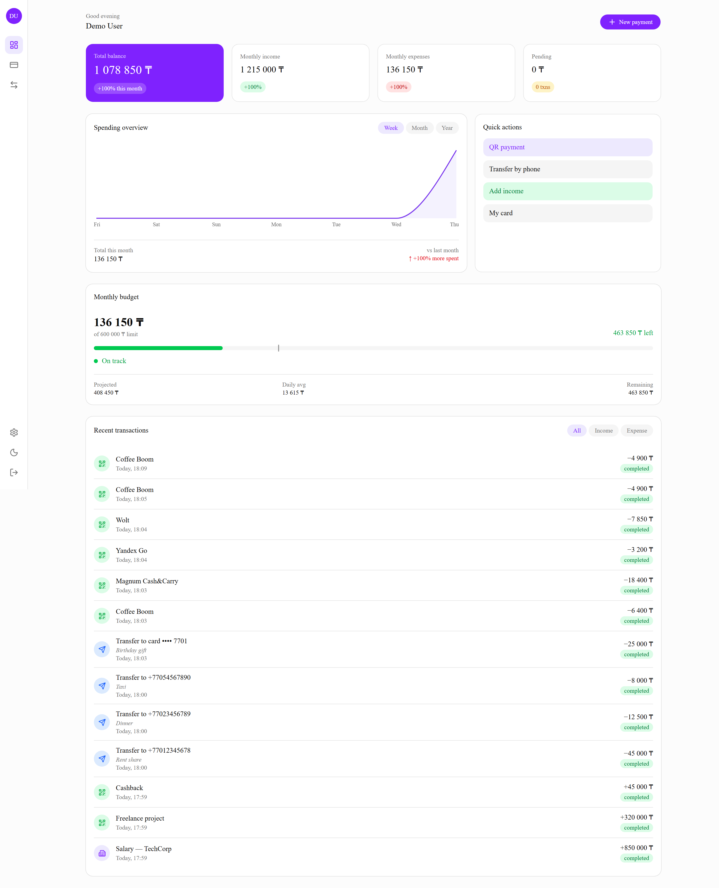

### Paying and transferring

`New payment` opens a method chooser; each method is its own FSD feature slice with its own hook, API module, and error mapping. The transfer form validates the number and amount inline, and offers to save the recipient — but the amount bounds, the balance check, the freeze check, and the monthly limit are all re-run in SQL before anything moves.

| New payment                                                 | Transfer by phone                                   |
| ----------------------------------------------------------- | --------------------------------------------------- |
| 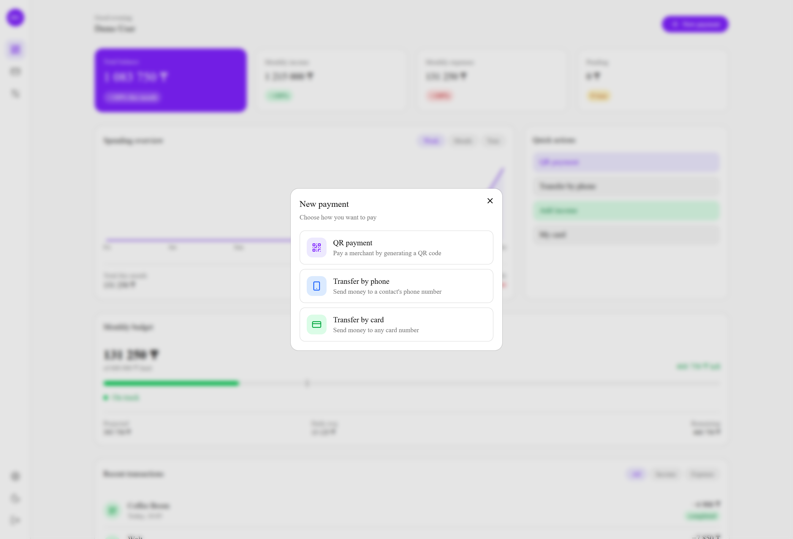 | 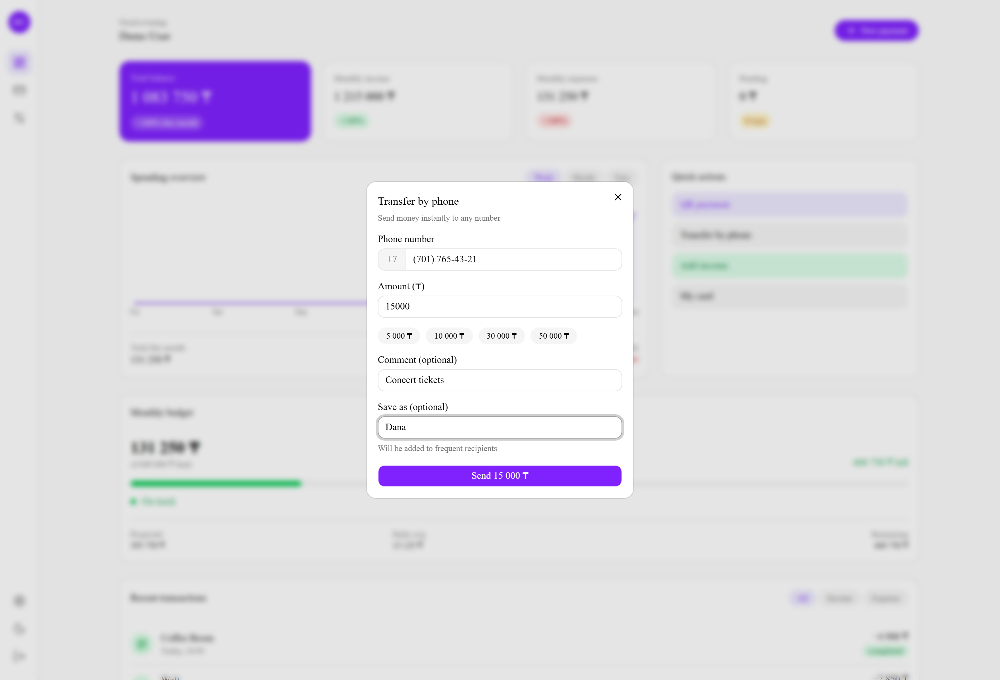 |

QR follows a real **authorize → capture** flow. Generating the code inserts a `pending` transaction and reserves nothing; the balance moves only on capture, which re-checks funds and the card's freeze state under a row lock. That's why the `Pending` stat card is populated while the code is on screen.

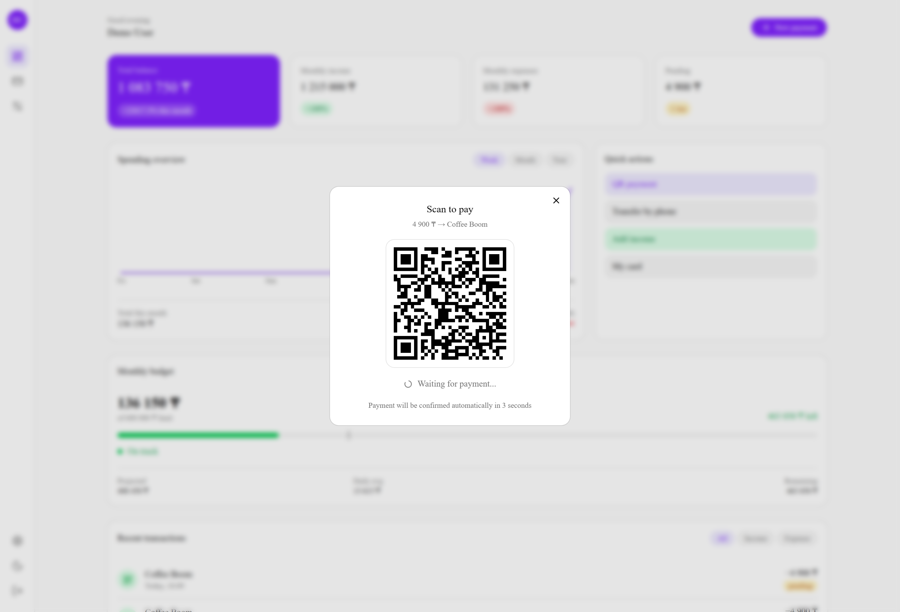

### Cards

One card per account, with freeze, reissue, removal, and a monthly spending limit that the database enforces on every transfer and QR payment — not just in the UI. The progress bar is the same `current_month_spent` sum the SQL functions check against.

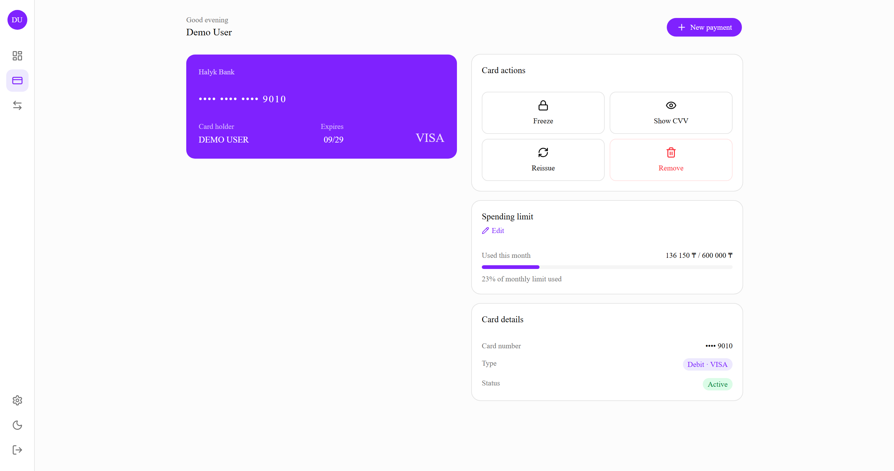

Revealing the CVV is the one read that cannot go through the table. The plaintext column is nulled by a trigger on write, and the ciphertext is hidden from direct reads by column-level grants, so the value comes back through a `security definer` RPC that decrypts with a key held in Supabase Vault and refuses any card that isn't the caller's.

| Reveal CVV                            | Spending limit                                         |
| ------------------------------------- | ------------------------------------------------------ |
| 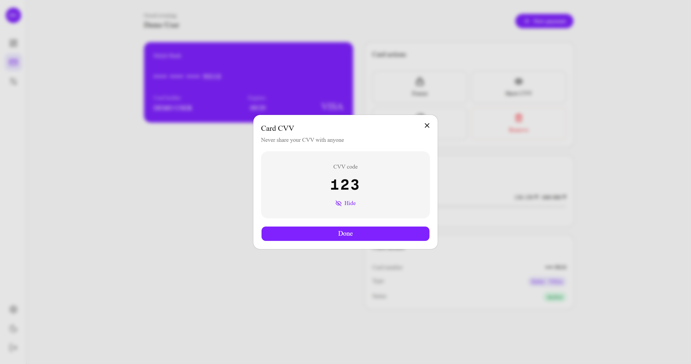 | 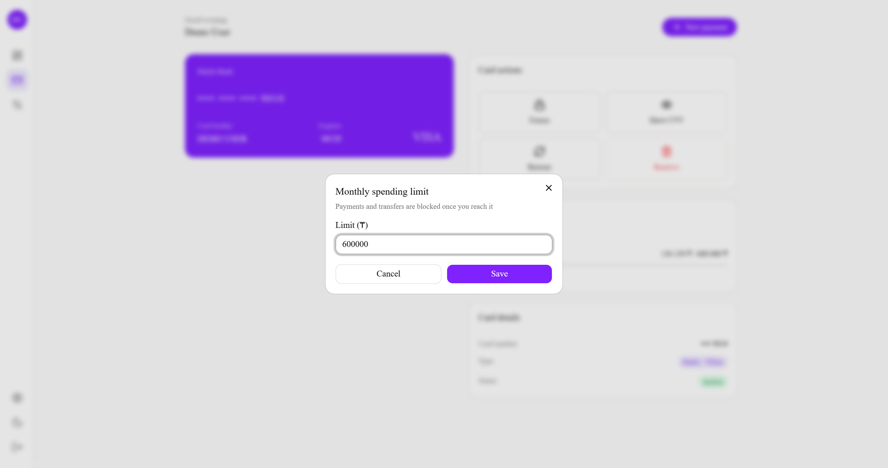 |

### Transfers

Frequent recipients, a breakdown of the month by method, and the transfer history.

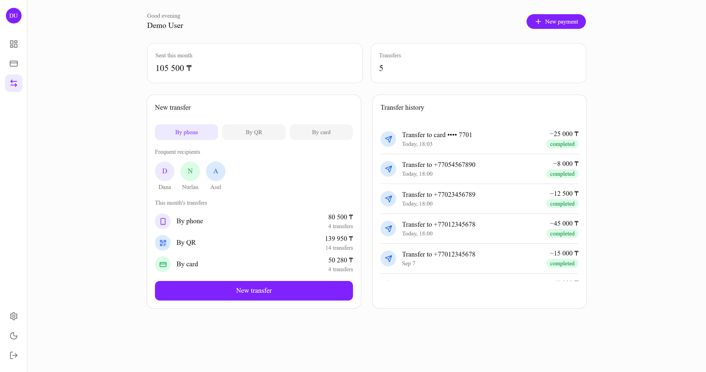

### Theme and language

Dark mode via `next-themes`, and a full English/Russian dictionary — including the money errors, which arrive from Postgres as `FP1xx` SQLSTATE codes and are translated on the client rather than shown as raw database text.

| Dark theme                                         | Russian                                              |
| -------------------------------------------------- | ---------------------------------------------------- |
| 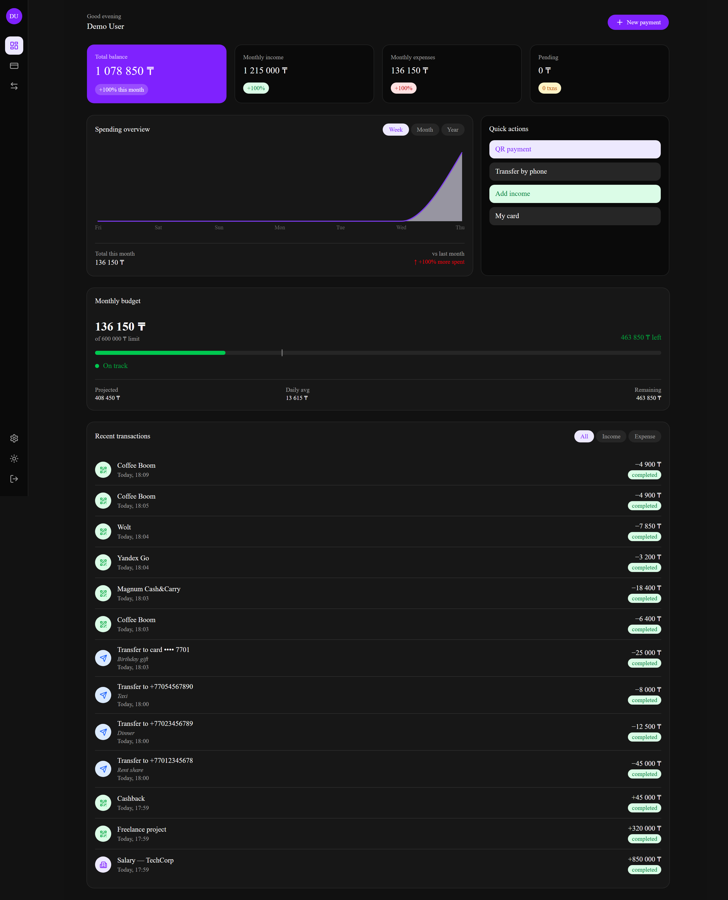 | 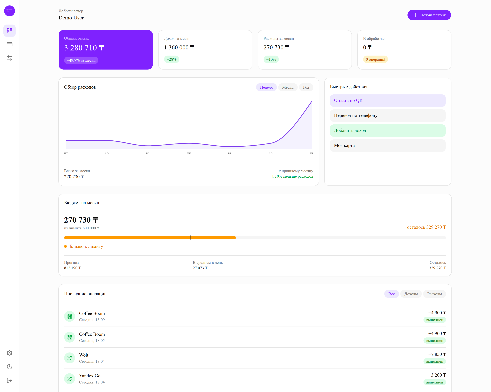 |

<details>
<summary>Sign in and settings</summary>

| Sign in                                | Settings                                   |
| -------------------------------------- | ------------------------------------------ |
| 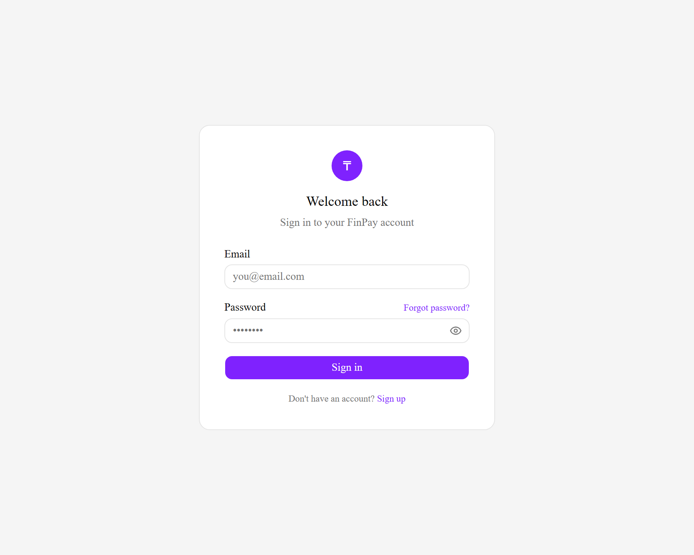 | 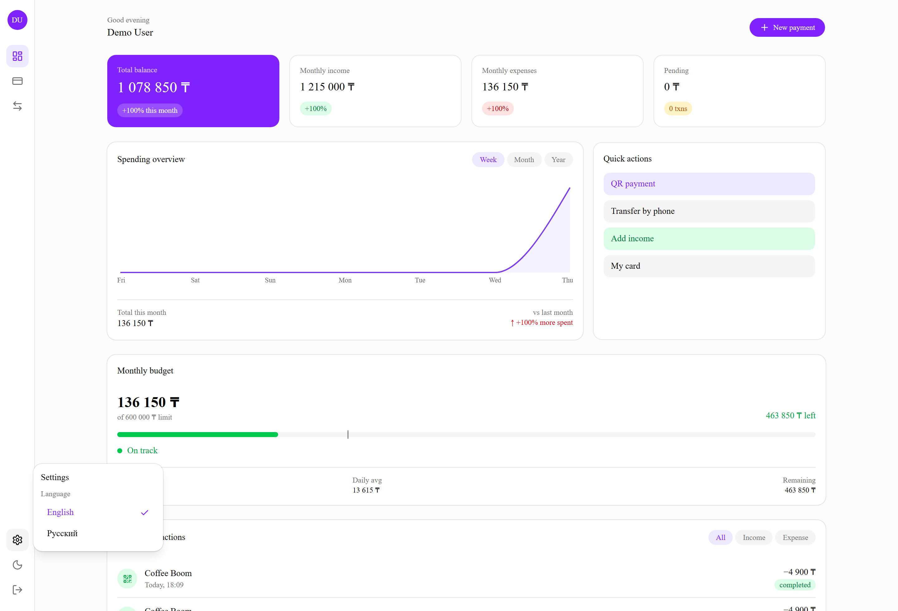 |

</details>

## Commands

```bash
npm run dev        # Dev server on localhost:3000
npm run build      # Production build (.next)
npm run start      # Serve the production build
npm run lint       # ESLint
npm run lint:fsd   # Feature-Sliced Design boundary check (steiger)
npm run typecheck  # Type check (tsc --noEmit)
npm run format     # Prettier
npm test           # Unit tests + migrations against a real Postgres (Vitest)
npm run test:watch # Vitest in watch mode
npm run commit     # Run every check, then compose a Conventional Commit
```

`npm run commit` is the intended way to commit. It refuses to start with an empty index, runs the five gates CI runs before the build — ESLint, FSD boundaries, Prettier, TypeScript, tests — and only then opens the [Commitizen](https://commitizen-tools.github.io/commitizen/) prompt for the type, scope, subject and body. A failing gate prints its output and stops, so a broken commit is never written in the first place rather than caught after the fact. `npm run commit -- --skip-checks` skips the gates when the change genuinely doesn't warrant 20 seconds of them; the husky hooks still run either way.

## Architecture

Next.js 16 (App Router) + TypeScript, organized with **Feature-Sliced Design (FSD)**. Imports point strictly downward — upper layers may import from lower ones, never the reverse.

```
app/                 # Next.js routes (thin — delegate to _pages)
src/
  _app/              # Providers, app shell, global styles
  _pages/            # Full pages (dashboard, cards, transfers)
  widgets/           # Composite UI blocks (header, sidebar, spending-chart…)
  features/          # Discrete user actions (transfer, add-income, qr-payment…)
  entities/          # Domain units: API + Zustand stores (user, card, transaction, recipient)
  shared/            # Micro level: supabase clients, lib, config, ui-kit, types
```

### State Management (Zustand, per-request)

Each entity owns its store in `entity/model`, but stores are **created per request, not as module singletons**: `createUserStore()` builds a vanilla Zustand store, a `UserStoreProvider` puts it in React Context, and `useUserStore(selector)` reads it. A module-level `create(…)` singleton is shared by every request the Node process handles — under SSR one user's balance could be rendered into another user's response. In a banking app that's not a theoretical concern, so the store's lifetime is bound to the render tree instead.

Initial data is fetched **on the server** and hydrated into those stores: [`app/(dashboard)/layout.tsx`](<app/(dashboard)/layout.tsx>) does the auth gate, `DashboardShell` loads profile, transactions, recipients, and card in one `Promise.all`, and `StoreProvider` seeds the stores with the result. The client fetches nothing on mount — there are no loader hooks and no skeleton flash. While the server queries run, the route streams `AppSkeleton` from a `<Suspense>` boundary.

This is why entity read methods are **client-agnostic** — they take an optional `client?: SupabaseClient` and default to the browser one, so the same `transactionApi.getAll` serves both the SSR layer (given the server client) and client-side refetches.

### Routing

Routes are declared with the Next App Router under `app/`. Auth guards live in `proxy.ts` (Next 16's renamed middleware): it validates the Supabase session and redirects unauthenticated users. Route constants are centralized in `shared/config/routes.ts`.

### API layer

Supabase browser/server clients live in `shared/api/supabase`. Reads go through the browser client; **all money mutations go through server-side `security definer` RPCs**. Every `api/index.ts` returns a normalized `{ data, error }` shape.

### Entity / feature structure

```
entities/transaction/
  api/       # Endpoint functions (Supabase queries + RPC)
  model/     # Zustand store, hooks, pure logic (stats.ts) + tests
  ui/        # Presentational components for this entity
  index.ts   # Public API (barrel export)
```

Features follow the same layout (`ui / model / api`) and expose only their public API through `index.ts`. Pure, deterministic business logic (trends, spending buckets, balance flow) is extracted into modules like `stats.ts` with the **clock injected as an argument**, so it's unit-testable without React.

### Path Aliases

TypeScript resolves: `#app`, `#shared`, `#entities`, `#features`, `#widgets`, `#pages`.

## Security & data integrity

### Money is server-authoritative and atomic

The client never computes or writes a balance. Every money operation is a Postgres `security definer` function (see [`supabase/migrations/0006_money_functions.sql`](supabase/migrations/0006_money_functions.sql)) that:

- derives the user from `auth.uid()` — the caller can't act as anyone else;
- validates amount bounds, balance, card freeze, and the card's monthly limit **on the server**;
- reads and debits the balance under `SELECT … FOR UPDATE`, so concurrent transfers can't race;
- inserts the transaction and updates the balance in a **single transaction**.

Client-side checks exist only for instant feedback; every one of them is repeated in SQL, because the browser is not a trust boundary. Freezing a card blocks spending in the database (see [`0008_enforce_card_freeze.sql`](supabase/migrations/0008_enforce_card_freeze.sql)) — including a re-check at QR capture, since a card can be frozen between authorization and settlement.

The client's `UPDATE` privilege on `profiles` is **revoked** — the only path to a balance change is these functions. QR payments use an **authorize → capture** model: creating a QR reserves nothing, and confirmation re-checks funds under lock, so multiple pending QRs can't overdraw the account.

### Card CVV is encrypted at rest

CVVs are never stored or readable in plaintext (see [`0002_card_cvv_encryption.sql`](supabase/migrations/0002_card_cvv_encryption.sql)):

- symmetric key held in **Supabase Vault**, encryption via **pgcrypto**;
- a `BEFORE` trigger encrypts on write and nulls the plaintext column;
- reading a CVV is only possible via a `security definer` RPC that decrypts **only the caller's own card**;
- column-level `GRANT`s hide the ciphertext from direct table reads.

### Row-Level Security

Every table has RLS enabled with policies scoped to `auth.uid()`, so users only ever read their own rows (see [`0000_init.sql`](supabase/migrations/0000_init.sql)).

RLS answers "which rows", not "which verbs", so privileges are narrowed on top of it wherever a policy isn't enough. `profiles` loses `UPDATE` in `0006`, and `transactions` is read-only to the client ([`0010_lock_transactions.sql`](supabase/migrations/0010_lock_transactions.sql)) — an RLS policy would happily let you delete _your own_ rows, and the ledger is exactly where that's unacceptable: the monthly card limit is computed by summing your spending rows, so a client-side `DELETE` would reset the limit. Writes to the ledger belong to the `security definer` functions, which run as the owner and are unaffected by the revoke.

### None of the above is taken on trust

Everything in this section is asserted against a real PostgreSQL in [`supabase/tests/migrations.test.ts`](supabase/tests/migrations.test.ts) — PGlite, so the suite is `npm test` and needs no Docker:

- the whole `migrations/` chain applies to an **empty** database, which is what makes "clone and run" a checked claim rather than a promise;
- a direct `UPDATE` of `balance` is refused, and so are `INSERT`/`UPDATE`/`DELETE` on the ledger;
- a frozen card blocks a transfer and a QR — **including one authorized before the freeze**;
- the monthly limit rejects the transfer that would cross it;
- QR reserves nothing, debits once, and a retried webhook does not debit twice;
- several pending QRs cannot overdraw the balance;
- one user sees zero rows of another's profile, ledger and card, and cannot move their money;
- a CVV never rests in plaintext, decrypts for its owner, and returns null to anyone else.

The suite earns its keep under mutation: drop the freeze check from `0008`, and the two freeze tests go red; re-grant writes on the ledger, and the ledger tests follow.

> **Simulated:** QR confirmation is triggered client-side to emulate an acquirer webhook (settlement itself runs server-side and atomically). There is no real payment processor. The tests stub the parts of Supabase the migrations lean on — `auth.uid()`, the roles, and Vault — so they verify this project's SQL, not Supabase's own guarantees.

## Getting Started

**Prerequisites:** Node.js 20+ and a [Supabase](https://supabase.com) project.

```bash
# 1. Install
npm install

# 2. Configure env — create .env.local
NEXT_PUBLIC_SUPABASE_URL=your-project-url
NEXT_PUBLIC_SUPABASE_ANON_KEY=your-anon-key

# 3. Apply the SQL migrations in supabase/migrations/ in order, starting with
#    0000_init.sql (Supabase Dashboard → SQL Editor, or `supabase db push`)

# 4. Run
npm run dev
```

Open [http://localhost:3000](http://localhost:3000), then register an account — new accounts start at a zero balance, so add income first to have something to move around.

Apply the migrations **in order, each exactly once**. They're written as a history: `0000_init.sql` creates the schema with baseline grants, and later files deliberately tighten it (`0001` closes direct reads of `cards.cvv`, `0006` revokes `UPDATE` on `profiles`, `0010` makes `transactions` read-only to the client). Re-running an early file against an already-migrated database would hand back a privilege a later one took away — `0000` in particular is for empty databases only.

## Deployment

The app is a standard Next.js Node.js server — any host that runs Node 20+ will serve it, and Vercel needs no configuration file.

**1. Vercel** — import the repository, then set two environment variables:

```
NEXT_PUBLIC_SUPABASE_URL=your-project-url
NEXT_PUBLIC_SUPABASE_ANON_KEY=your-anon-key
```

Both are `NEXT_PUBLIC_` because the browser genuinely needs them, and the anon key is designed to be public. It is not what keeps data safe: RLS scopes every row to `auth.uid()`, the money functions derive the user from the session rather than from arguments, and the client's privilege to write a balance or the ledger is revoked outright. Handing someone the anon key gets them exactly what any visitor already has.

**2. Supabase → Authentication → URL Configuration** — this step is easy to skip and breaks password reset in a way nothing else catches:

- **Site URL**: `https://<your-app>.vercel.app`
- **Redirect URLs**: add `https://<your-app>.vercel.app/**`, keeping `http://localhost:3000/**` for local work.

`resetPasswordForEmail` asks Supabase to send the user back to `<origin>/auth/confirm`. Supabase honours that only if it matches the allowlist — otherwise it quietly falls back to the Site URL, so an unconfigured production sends real users to whatever is in that field (`localhost:3000`, out of the box). Nothing errors; the link just goes to the wrong machine.

## Conventions

- **Commits** — [Conventional Commits](https://www.conventionalcommits.org/), composed by Commitizen through `npm run commit` and enforced by commitlint + husky, so the same convention is both generated and validated; lint-staged runs ESLint + Prettier on staged files.
- **Styling** — Tailwind CSS v4; `cn()` (clsx + tailwind-merge) for class composition; `prettier-plugin-tailwindcss` orders classes.
- **UI** — Base UI primitives with shadcn-style components in `shared/ui`.
- **State** — Zustand stores per entity/feature.
- **Tests** — Vitest. Unit tests sit next to the pure functions they cover (`*.test.ts`); the migration suite lives in `supabase/tests` and runs the real SQL against PGlite.
- **TypeScript** — strict mode; the build fails on type errors.

## License

MIT — see [LICENSE](LICENSE).
